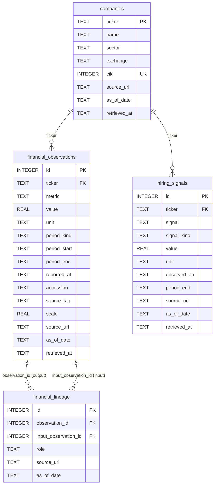

# Agent Techhome

[](https://github.com/namanxdev/persona-financial-agent/actions/workflows/ci.yml)

A single, persona-configurable financial research agent that answers questions about 24
US-listed companies across three sectors (tech, retail, logistics), grounded live in a SQLite
database it reaches only through an MCP tool boundary. The same agent function is exposed two
ways: a Streamlit chat UI and a FastAPI `POST /query` endpoint.

## Contents

- [Setup](#setup)
- [Running the interfaces](#running-the-interfaces)
- [Deployment](#deployment)
- [Rebuilding the database](#rebuilding-the-database)
- [Schema](#schema)
- [Sourcing method and data-quality caveats](#sourcing-method-and-data-quality-caveats)
- [MCP design](#mcp-design)
- [Confidence rule](#confidence-rule)
- [LLM provider](#llm-provider)
- [Grounded synthesis](#grounded-synthesis)
- [Eval results](#eval-results)
- [What's covered by the data](#whats-covered-by-the-data)
- [One thing I'd improve with more time](#one-thing-id-improve-with-more-time)

## Setup

Requires **Python 3.12** and [`uv`](https://docs.astral.sh/uv/).

```bash
git clone https://github.com/namanxdev/persona-financial-agent.git
cd persona-financial-agent
uv sync
cp .env.example .env
```

Edit `.env`:

- `SEC_USER_AGENT` -- **required only if you rebuild the database.** The committed
  `data/agent_techhome.db` ships in the repo, so a reviewer who just wants to run the app does
  not need this key at all.
- `OPENAI_API_KEY` -- **optional.** Without it, a deterministic fallback composer runs instead
  of an LLM call, so the app, API, and evals are all runnable keyless. See
  [LLM provider](#llm-provider).

## Running the interfaces

Both interfaces call the exact same shared function, `agent.core.answer_query` -- there is one
orchestration implementation, not two.

### Streamlit (human-facing)

```bash
uv run streamlit run ui/app.py
```

Select a persona and a sector independently (all 9 combinations are valid), type a question, and
submit. The answer, referenced companies, an evidence table (with clickable source links),
derived confidence, and the ordered MCP tool-call trace all render on the page. If the MCP server
process is unreachable or the model call fails, the page shows the error directly -- it never
falls back to answering from model memory.

**Compare all three personas** runs the *same* question through all three personas against the
same sector and lays the results out side by side: required metrics, screen metric and direction,
collapsed tool sequence, companies surfaced, answer, and risks. The claim that persona changes
retrieval rather than tone is the one thing this project most needs to demonstrate, and three
paragraphs of prose are a poor way to show it -- three tool traces next to each other are not.
The view states plainly whether all three sequences and all three company sets actually differ
for the question asked, including when they do not.

### FastAPI (programmatic)

```bash
uv run uvicorn api.main:app --reload
```

```bash
curl -X POST http://localhost:8000/query \
  -H "Content-Type: application/json" \
  -d '{
    "query": "What is the most recent headcount signal you have for FedEx?",
    "persona": "pe_analyst",
    "sector": "logistics"
  }'
```

Captured verbatim from that request against the committed database, with `OPENAI_API_KEY` set:

```json
{
  "answer": "FedEx (FDX) demonstrates strong cash generation with a free cash flow (TTM) of $5.7B, indicating solid financial health. However, with a headcount of 300,000 employees and an EV/EBITDA of 8.92x, caution is warranted regarding operational efficiency and potential leverage risks. Supporting evidence: Free cash flow (TTM) of $5.7B Headcount of 300,000 employees EV/EBITDA of 8.92x Strong cash generation capacity Large workforce indicates operational scale Potential for leverage if needed Risks: High headcount may lead to operational inefficiencies Leverage could increase financial risk Market volatility affecting logistics demand Potential for rising costs impacting margins Economic downturns could reduce shipping volumes Competitive pressures in the logistics sector Limitations: Data is as of 2026-09-07 Does not account for future market conditions Limited to cash flow and balance sheet metrics No qualitative insights on management or strategy Does not consider external economic factors Focuses solely on FedEx without sector comparison",
  "persona": "pe_analyst",
  "sector": "logistics",
  "companies_referenced": [
    "FDX"
  ],
  "evidence": [
    {
      "evidence_id": "FDX:free_cash_flow_ttm",
      "ticker": "FDX",
      "field": "free_cash_flow_ttm",
      "value": 5656625152.0,
      "unit": "USD",
      "as_of_date": "2026-09-07",
      "source_url": "https://finance.yahoo.com/quote/FDX/key-statistics/",
      "source_lineage": [
        {
          "source_url": "https://finance.yahoo.com/quote/FDX/key-statistics/",
          "as_of_date": "2026-09-07",
          "field": "free_cash_flow_ttm",
          "value": 5656625152.0,
          "unit": "USD",
          "period_kind": "observation",
          "period_start": null,
          "period_end": null
        }
      ]
    },
    {
      "evidence_id": "FDX:enterprise_to_ebitda",
      "ticker": "FDX",
      "field": "enterprise_to_ebitda",
      "value": 8.924,
      "unit": "ratio",
      "as_of_date": "2026-09-07",
      "source_url": "https://finance.yahoo.com/quote/FDX/key-statistics/",
      "source_lineage": [
        {
          "source_url": "https://finance.yahoo.com/quote/FDX/key-statistics/",
          "as_of_date": "2026-09-07",
          "field": "enterprise_to_ebitda",
          "value": 8.924,
          "unit": "ratio",
          "period_kind": "observation",
          "period_start": null,
          "period_end": null
        }
      ]
    },
    {
      "evidence_id": "FDX:headcount:2026-09-07",
      "ticker": "FDX",
      "field": "headcount",
      "value": 300000.0,
      "unit": "employees",
      "as_of_date": "2026-09-07",
      "source_url": "https://finance.yahoo.com/quote/FDX/profile/",
      "source_lineage": [
        {
          "source_url": "https://finance.yahoo.com/quote/FDX/profile/",
          "as_of_date": "2026-09-07",
          "field": "headcount",
          "value": 300000.0,
          "unit": "employees",
          "period_kind": "observation",
          "period_start": null,
          "period_end": null
        }
      ]
    }
  ],
  "confidence": "high",
  "tools_called": [
    "list_companies",
    "get_financials",
    "get_hiring_signals"
  ],
  "synthesis": {
    "thesis": "FedEx (FDX) demonstrates strong cash generation with a free cash flow (TTM) of $5.7B, indicating solid financial health. However, with a headcount of 300,000 employees and an EV/EBITDA of 8.92x, caution is warranted regarding operational efficiency and potential leverage risks.",
    "supporting_points": [
      "Free cash flow (TTM) of $5.7B",
      "Headcount of 300,000 employees",
      "EV/EBITDA of 8.92x",
      "Strong cash generation capacity",
      "Large workforce indicates operational scale",
      "Potential for leverage if needed"
    ],
    "risks": [
      "High headcount may lead to operational inefficiencies",
      "Leverage could increase financial risk",
      "Market volatility affecting logistics demand",
      "Potential for rising costs impacting margins",
      "Economic downturns could reduce shipping volumes",
      "Competitive pressures in the logistics sector"
    ],
    "limitations": [
      "Data is as of 2026-09-07",
      "Does not account for future market conditions",
      "Limited to cash flow and balance sheet metrics",
      "No qualitative insights on management or strategy",
      "Does not consider external economic factors",
      "Focuses solely on FedEx without sector comparison"
    ],
    "evidence_ids": [
      "FDX:free_cash_flow_ttm",
      "FDX:enterprise_to_ebitda",
      "FDX:headcount:2026-09-07"
    ]
  }
}
```

Two things in that response are worth reading closely. Every figure in `answer` -- `$5.7B`,
`300,000 employees`, `8.92x`, `2026-09-07` -- appears in an `evidence` row, because the model is
only ever shown the rendered display strings and every number it writes back is checked against
them (see [Grounded synthesis](#grounded-synthesis)). And `source_lineage` is populated per
evidence item: for a derived metric it lists every constituent observation (value, unit, period,
date, URL) that fed the calculation, not just a final number.

Run the same request with no `OPENAI_API_KEY` and the `evidence`, `confidence`, and `tools_called`
fields come back identical, `synthesis` is `null`, and `answer` is the deterministic composition:

```
From a deal/ops view of logistics: the retrieved data argues for caution. FDX's free cash flow
(TTM) is $5.7B as of 2026-09-07. FDX's EV/EBITDA is 8.92x as of 2026-09-07. FDX's latest
hiring/headcount signal: 300,000 employees as of 2026-09-07
(https://finance.yahoo.com/quote/FDX/profile/).
```

## Deployment

Not deployed from this repository yet. When it is, the live URL belongs at the top of this file;
what follows is what a deployment actually needs.

**Streamlit Community Cloud** is the natural target: one Streamlit entry point, a committed
database, and nothing at query time that needs network access.

1. Push this repository to GitHub and, on share.streamlit.io, create an app pointing at
   `ui/app.py` on `main`.
2. Dependencies come from the committed `requirements.txt`, exported from the lockfile with
   `uv export --format requirements-txt --no-hashes --no-dev -o requirements.txt`. Regenerate it
   whenever `pyproject.toml` changes, or the deployment quietly drifts from `uv.lock`.
3. Add `OPENAI_API_KEY` under the app's **Secrets** to get the synthesis path live. Without it
   the deployment runs the deterministic composer and still works end to end -- which also makes
   a keyless deploy a reasonable choice if you would rather not put a key on a hosted app.

**The thing to watch.** Every request spawns `python -m mcp_server.server` as a real subprocess.
That is the property this project exists to demonstrate, not an implementation detail, so it
cannot be optimised away for a host that dislikes it. A normal container platform runs it fine;
a sandbox that forbids process spawning will fail at the first tool call, and the app log will
show it as an MCP transport error rather than a wrong answer. If a target host forbids
subprocesses, the honest fixes are a different host or running the MCP server as a separate
long-lived service -- not collapsing the boundary into an in-process call.

## Rebuilding the database

The committed `data/agent_techhome.db` is a valid, checked-in snapshot -- rebuilding is optional
unless you want fresher source data.

```bash
export SEC_USER_AGENT="your-app your-real-email@your-domain.com"
uv run python scripts/build_db.py
```

- Builds into a temporary same-directory file, validates it, then atomically replaces
  `data/agent_techhome.db` only on success. A failed refresh leaves the previous database intact.
- `--offline` replays responses already captured under `.source-cache/` with no network access.

  ```bash
  uv run python scripts/build_db.py --offline
  ```

  **`.source-cache/` is not in this repository** -- it is gitignored, and at ~84 MB of raw SEC
  and Yahoo payloads it is not something to commit. A fresh clone therefore has nothing to
  replay: `--offline` only works after at least one live build has populated the cache locally.
  It exists so that a *rebuild* is repeatable on a machine that has already fetched once, which
  matters because `yfinance` output can shift between runs -- not so that a reviewer can rebuild
  without network access. Reviewers do not need either path: `data/agent_techhome.db` is
  committed and the app runs against it as-is.
- `--database PATH` and `--cache-dir PATH` override the defaults (`data/agent_techhome.db` and
  `.source-cache/`) if you want to build a scratch copy without touching the committed file.

SEC's Company Facts API requires a real contact identity in the `User-Agent` header; the build
refuses to run against live SEC with a placeholder address.

## Schema



Exact columns are transcribed from `scripts/schema.sql`; `value`, `unit`, `period_start`,
`period_end`, `reported_at`, `accession`, `source_tag`, and `signal`/hiring `value`/`unit` are
nullable, everything else (including every `source_url` and `as_of_date`, on every table) is
`NOT NULL`.

**Why row-per-fact with explicit period semantics, not a wide table.** A tech company's revenue
is a `fiscal_year` flow figure; a balance-sheet field like `stockholders_equity` is an `instant`
snapshot; a Yahoo market metric like `market_cap` is an `observation` snapshot taken at retrieval
time, not a filed period at all. Forcing these into fixed columns on one wide row would either
lose that distinction or require a different schema per metric type. One row per
`(ticker, metric, period_kind, period_start, period_end, as_of_date, source_url)` lets every fact
declare its own period kind, and lets the confidence and grounding logic reason uniformly about
"how old is this specific value" regardless of what kind of fact it is.

**Why lineage is a separate table.** A derived ratio (e.g. `fcf_margin` = `free_cash_flow` /
`revenue`, itself derived from `operating_cash_flow` - `capital_expenditures`) needs to point back
to every input observation that produced it, each with its own value, unit, period, and source --
not just a single parent pointer. `financial_lineage` is a many-to-many join
(`observation_id` -> the derived row, `input_observation_id` -> a constituent raw or intermediate
row, `role` -> which input it played), so one raw observation can feed multiple derived metrics
and one derived metric can cite multiple inputs, and an evidence item can render its full
derivation chain rather than an opaque final number.

**Why every row carries `source_url` and `as_of_date`.** The grounding rule is that every factual
clause in an answer must map to a row a tool actually returned this turn, and the confidence
score is computed from real per-slot freshness (see [Confidence rule](#confidence-rule)). Both of
those require a semantic date and a citable URL on every row, including lineage rows -- there is
no path through the schema where a value can be cited without also being dated and sourced.

## Sourcing method and data-quality caveats

**Method.** `scripts/build_db.py` pulls two public sources per company: SEC's XBRL Company Facts
API (`scripts/sec_source.py`) for filed annual (`10-K`/`10-K/A`, `FY`) and instant balance-sheet
facts, restricted to 350-380 day fiscal years and verified by CIK and entity name; and `yfinance`
(`scripts/yfinance_source.py`) for a headcount/hiring signal and a set of market snapshots,
verified by ticker, equity type, US exchange, and USD currency. `scripts/derive_metrics.py` then
computes ratios (margins, FCF, leverage, revenue growth) only when the inputs share a compatible
unit and period, recording full lineage for each. Nothing is filled in when a source has no
retrievable value -- unavailable facts stay SQL `NULL`, never zero or estimated.

**Known caveats, verified against the committed database:**

- **Uneven SEC tag coverage.** `liabilities_to_equity` resolves for 13 of 24 tickers and
  `fcf_margin` for 17 of 24 -- some filers use XBRL tags outside the taxonomy variants this build
  checks, or omit a required input (e.g. no separately-reported capex). `run_sector_screen`
  reports the remainder in its `excluded` list with a reason rather than silently ranking a
  partial cohort as if it were the whole sector.
- **Yahoo market snapshots are point-in-time, not filed periods.** Fields like `market_cap`,
  `trailing_pe`, and `enterprise_to_ebitda` are captured at retrieval and stored with
  `period_kind = 'observation'` -- they describe "as observed on this date," not a fiscal period,
  and are labeled that way throughout rather than presented alongside filed financials as if
  comparable.
- **Fiscal years are not calendar-aligned across companies.** Most retail names in this dataset
  run January/February fiscal year-ends (e.g. `BBY` 2026-01-31, `WMT`/`KR`/`TGT` 2026-01-31,
  `HD` 2026-02-01, `LOW`/`DG` 2026-01-30) -- `COST` is the exception, at 2025-08-31. Cross-company
  comparisons enforce matching period kind/unit/scale (`_consecutive_comparable` in
  `derive_metrics.py`) rather than assuming any two companies' "latest annual" rows line up on
  the calendar.
- **Filed data ages faster than it looks.** Because `as_of_date` on a `fiscal_year` row is the
  filed period end, not "today," a company's most recent 10-K figures can already be several
  months to just under a year old by query time -- interacting directly with the confidence
  freshness bands below rather than always scoring as maximally fresh.
- **`yfinance` is an unofficial wrapper around undocumented Yahoo endpoints,** not a stable
  published API -- field availability and shape can change between runs. `--offline` mode
  replays cached responses so a rebuild is repeatable even if live Yahoo output shifts, but only
  on a machine whose `.source-cache/` a previous live build already filled.

- **Company-name resolution is a heuristic, not an NER model.** Six aliases double as ordinary
  finance vocabulary (`target`, `meta`, `low`, `cost`, `best buy`, `apple`), so those are matched
  only when capitalised as proper nouns: "What about Target?" resolves to TGT, while "the target
  market" stays a sector-wide query. Every other alias matches case-insensitively but only on
  whole-word boundaries, so "expose the cost" no longer resolves to XPO. The residual gap is a
  sentence-initial ambiguous alias ("Low margins are a concern") which will still read as a
  company mention.

## MCP design

The agent reaches data through exactly four fixed, typed tools --
`list_companies`, `get_financials`, `get_hiring_signals`, `run_sector_screen` -- served by
`mcp_server/server.py` over stdio, not a generic SQL/query tool. That boundary is deliberate:

- **Fixed tools instead of generic SQL** keep every possible retrieval shape enumerable and
  typed (the Pydantic row models in `mcp_server/models.py`), so a persona's tool calls are a legible,
  reviewable trace rather than arbitrary generated queries the agent could use to sidestep the
  grounding rules (e.g. no schema for it to write a query that fabricates a join).
- **The database driver lives only server-side**, inside `mcp_server/`. The `agent/` package
  imports no DB driver at all -- it reaches every fact through an MCP client session. This is
  checked mechanically (`rg -n "sqlite3|import duckdb|psycopg" agent` must return nothing) and is
  the structural requirement this design is built around: the agent cannot reach the data any
  other way, by construction rather than by convention.
- **The MCP server is a separate stdio process**, not an in-process function call. If that
  process dies or was never started, `answer_query` has no direct-handler or database fallback to
  fall back to -- the failure surfaces as an explicit error in both the API response and the
  Streamlit page, rather than the agent silently answering from the model's training data.

## Confidence rule

Confidence is computed, never chosen by the model. Exact rule, implemented in
`agent/confidence.py`:

1. Create one slot for each `(company, required metric)` in the final retrieval plan, plus one
   slot for each explicitly requested hiring signal. Let `N` be the slot count (minimum 1).
2. Coverage: `C = non_null_slots / N`.
3. Per-slot freshness `f`, from that slot's semantic `as_of_date` age in days:
   - `1.0` for age <= 180 days
   - `0.6` for 181-450 days
   - `0.25` for 451-730 days
   - `0` for older than 730 days, missing, **or a future date** (future dates are invalid, not
     fresh)
4. Aggregate freshness: `F = sum(f) / N`.
5. `score = 0.65 * C + 0.35 * F`.
6. **High** requires `score >= 0.80` **and** every required slot fresh within 180 days; otherwise
   the result is capped at medium even if the score alone would qualify.
7. **Medium** requires `score >= 0.50`. Everything else -- including out-of-scope and no-data
   results -- is **low**.

The model never sees or sets this value; it is derived purely from which slots came back non-null
and how stale their dates are, using every slot's own age so one fresh row cannot mask other
stale or missing ones.

## LLM provider

**OpenAI**, via the `openai` package, model `gpt-4o-mini` (override with `OPENAI_MODEL`).
Key: `OPENAI_API_KEY`, **optional**. Put it in `.env` -- `agent/config.py` loads that file into
the environment on import, and a real exported environment variable takes precedence over the
file. `.env` is gitignored; `.env.example` shows the shape.

The model is called at most twice per request: once for a stance token, once to write the answer.
Both are optional. With no key, or on any provider error, the deterministic composer in
`agent/grounding.py` writes the answer and the whole system runs offline.

## Grounded synthesis

The obvious way to stop an LLM inventing financial figures is to never let it near them: have it
pick a stance token, fill the numbers into templates, done. That is what this project did first.
It is genuinely safe -- and a reviewer can fairly call it a rules-based screener with an LLM
classifier attached, not an agent doing financial reasoning.

The current design keeps the guarantee and drops the constraint. The model writes the answer; it
simply cannot state anything the evidence does not support, and that is enforced mechanically
rather than by prompt.

**What the model is given** (`agent/evidence_guard.py`, `evidence_payload`): the evidence rows
retrieved this turn, rendered to display strings --

```json
{"evidence_id": "FDX:free_cash_flow_ttm", "ticker": "FDX",
 "metric": "free cash flow (TTM)", "display": "$5.7B", "as_of_date": "2026-09-07"}
```

Raw floats are deliberately withheld. The only numbers in front of the model are the exact
strings the validator will accept back, which makes "copy it verbatim" an instruction it can
actually satisfy.

**What it must return**: one JSON object -- `thesis`, `supporting_points`, `risks`,
`limitations`, and the `evidence_ids` it relied on.

**What is checked before any of it reaches the user** (`agent/evidence_guard.py`, `validate`):

| Check | What it rejects |
| --- | --- |
| Every cited `evidence_id` was retrieved this turn | A citation to a row no tool returned |
| Every ticker-shaped token was retrieved this turn | "NVDA looks cheaper" when NVDA is not in the data |
| Every number appears verbatim in a display value or `as_of_date` | An invented figure -- and equally a *computed* one, since an average or a delta is still a number no tool returned |
| Per sentence: one named company means its figures must be that company's | A real number attached to the wrong company |
| Non-empty thesis, at least one supporting point, length proportionate to the evidence | Empty or runaway output |

A candidate failing any check is discarded and the deterministic composer writes the answer
instead -- the same path taken when no key is configured. The grounding guarantee therefore rests
on a validator rather than on the model's compliance, and the failure mode is a plainer answer,
never a wrong one. `agent/models.py:Synthesis` is `null` in the response whenever that happened.

**What this does not check.** Attribution is verified per sentence, so a figure moved to the
wrong company is caught only when that sentence names exactly one company. A sentence naming two
is checked against the full retrieved set. Qualitative claims ("integration risk is high") are
the model's own and are not checkable against a database at all -- they are labelled as risks and
limitations rather than presented as findings.

**Observed behaviour.** On live `gpt-4o-mini` runs on 2026-09-09, the first two rejections were
both validator bugs rather than model misbehaviour, and both are now regression tests in
`tests/test_synthesis.py`: `EV/EBITDA` was being read as a ticker called `EV/`, and one persona
was rejected for discussing a company it had retrieved but not formally cited. After those fixes
every sampled run validated -- three persona/sector pairs, a three-persona comparison on tech,
and the captured API response above.

`AGENT_SYNTHESIS=off` forces the deterministic composer even with a key configured. The test
suite and CI both set it, which is what makes the results below reproducible rather than
model-dependent.

## Eval results

Run on 2026-09-09 against the committed database, over a real stdio MCP subprocess, with no
`OPENAI_API_KEY` set -- the same configuration CI uses, so the deterministic composer produced
every answer and this output is reproducible rather than model-dependent:

```
$ OPENAI_API_KEY= uv run python evals/run_evals.py

CASE                               RESULT  DETAIL
divergence_tech_investment_case    PASS    sequences_differ=True sets_differ=True all_have_evidence=True
divergence_retail_attractive_case  PASS    sequences_differ=True sets_differ=True all_have_evidence=True
divergence_logistics_outlook_case  PASS    sequences_differ=True sets_differ=True all_have_evidence=True
grounding_ups_headcount            PASS    expected UPS.headcount=460000.0, got 460000.0
grounding_msft_operating_margin    PASS    expected MSFT.operating_margin_ttm=0.45111, got 0.45111
grounding_cost_revenue_growth      PASS    expected COST.revenue_growth_yoy=0.215, got 0.215
refusal_unknown_ticker_style       PASS    confidence=low evidence=[] answer="I don't have 'RIVN' in
                                           the logistics sector dataset, so I can't answer about it"
refusal_unknown_mixed_case_name    PASS    confidence=low evidence=[] answer="I don't have 'Snowflake'
                                           in the tech sector dataset, so I can't answer about it"

8/8 cases passed
```

(The three divergence rows also print each persona's full tool sequence and company set. Those
columns are elided above for width and reproduced in the table below.)

Test suite alongside it: `uv run python -m pytest -q` -> **53 passed**, same run, same day.

The divergence cases ask one identical question per sector and run it through all three personas,
asserting the tool sequences and the surfaced company sets both differ. The retrieval those three
cases actually produced for tech:

| Persona | Tool sequence | Companies surfaced |
| --- | --- | --- |
| Mutual fund | `list_companies`, `run_sector_screen`, 6x `get_financials`, 2x `get_hiring_signals` | AAPL, CSCO, GOOGL, META, MSFT, ORCL |
| Equity | `list_companies`, `run_sector_screen`, 6x `get_financials`, `run_sector_screen` | AAPL, ADBE, GOOGL, IBM, META, MSFT, ORCL |
| PE | `list_companies`, 8x `get_financials`, `run_sector_screen`, 3x `get_hiring_signals` | all 8 tech tickers |

The grounding expectations are read out of the database at eval time by a direct `sqlite3` query
in `evals/cases.py`, which is a different code path from the agent's MCP retrieval. The assertion
is therefore that two independent paths agree, not that the agent agrees with itself.

**Honest caveat on the divergence assertion.** The PE persona pulls `get_financials` across the
whole sector before screening, so it surfaces all 8 tickers by construction. That makes
"PE's set differs from the other two" structurally true rather than data-driven. The
mutual-fund-vs-equity difference is the genuinely metric-driven one (CSCO against ADBE/IBM in
tech, on different screens). A stronger eval would assert that the mutual fund and equity sets
differ specifically, and would verify divergence survives a change in the underlying values.

## What's covered by the data

Verified directly against the committed `data/agent_techhome.db`:

- 24 US-listed companies: 8 tech, 8 retail, 8 logistics.
- 918 rows in `financial_observations`.
- 1,160 rows in `financial_lineage`.
- A non-null, sourced headcount signal in `hiring_signals` for all 24 tickers.

## One thing I'd improve with more time

Widen SEC tag coverage for `liabilities_to_equity` and `fcf_margin` beyond the current fixed tag
lists in `scripts/sec_source.py`. Right now 11 of 24 companies are permanently excluded from any
leverage screen and 7 of 24 from any FCF-margin screen because their filings use an XBRL concept
outside the small set of tag variants this build checks (e.g. an alternate equity or capex tag).
A fallback resolution pass -- trying a broader tag alias list per metric, or falling back to a
computed proxy when the primary tag is absent -- would let PE-persona leverage screens and
mutual-fund-persona quality screens actually rank close to the full 24-company universe instead
of quietly working with a 13- or 17-company subset for exactly the personas that lean on those
two metrics most.
