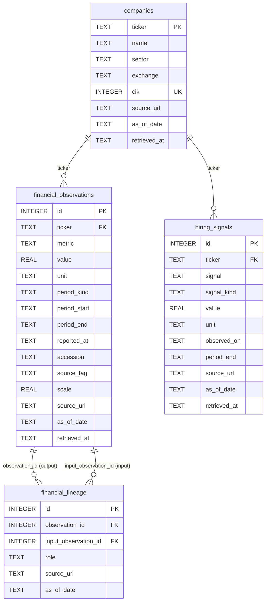

# Agent Techhome

A single, persona-configurable financial research agent that answers questions about 24
US-listed companies across three sectors (tech, retail, logistics), grounded live in a SQLite
database it reaches only through an MCP tool boundary. The same agent function is exposed two
ways: a Streamlit chat UI and a FastAPI `POST /query` endpoint.

## Contents

- [Setup](#setup)
- [Running the interfaces](#running-the-interfaces)
- [Rebuilding the database](#rebuilding-the-database)
- [Schema](#schema)
- [Sourcing method and data-quality caveats](#sourcing-method-and-data-quality-caveats)
- [MCP design](#mcp-design)
- [Confidence rule](#confidence-rule)
- [LLM provider](#llm-provider)
- [Eval results](#eval-results)
- [What's covered by the data](#whats-covered-by-the-data)
- [One thing I'd improve with more time](#one-thing-id-improve-with-more-time)

## Setup

Requires **Python 3.12** and [`uv`](https://docs.astral.sh/uv/).

```bash
git clone <this-repo>
cd agent-techhome
uv sync
cp .env.example .env
```

Edit `.env`:

- `SEC_USER_AGENT` -- **required only if you rebuild the database.** The committed
  `data/agent_techhome.db` ships in the repo, so a reviewer who just wants to run the app does
  not need this key at all.
- `OPENAI_API_KEY` -- **optional.** Without it, a deterministic fallback composer runs instead
  of an LLM call, so the app, API, and evals are all runnable keyless. See
  [LLM provider](#llm-provider).

## Running the interfaces

Both interfaces call the exact same shared function, `agent.core.answer_query` -- there is one
orchestration implementation, not two.

### Streamlit (human-facing)

```bash
uv run streamlit run ui/app.py
```

Select a persona and a sector independently (all 9 combinations are valid), type a question, and
submit. The answer, referenced companies, an evidence table (with clickable source links),
derived confidence, and the ordered MCP tool-call trace all render on the page. If the MCP server
process is unreachable or the model call fails, the page shows the error directly -- it never
falls back to answering from model memory.

### FastAPI (programmatic)

```bash
uv run uvicorn api.main:app --reload
```

> Assumption: the ASGI app instance in `api/main.py` is named `app`, per FastAPI/uvicorn
> convention. `api/main.py` did not exist yet while this README was written (it is owned by the
> parallel Stage 4 implementation); adjust the `uvicorn` target above if it is named differently.

```bash
curl -X POST http://localhost:8000/query \
  -H "Content-Type: application/json" \
  -d '{
    "query": "Which companies in this sector look like attractive buyout targets based on the data you have?",
    "persona": "pe_analyst",
    "sector": "logistics"
  }'
```

Representative response shape (illustrative -- built from the `QueryResponse` model in `agent/models.py`
and real values read from the committed database; not a captured run, since this file was written
before the agent existed to run):

```json
{
  "answer": "Among logistics names with comparable data, XPO carries an operating margin of 8.0% (FY2025, 10-K) and GXO an FCF margin of 0.8% (FY2025, 10-K)...",
  "persona": "pe_analyst",
  "sector": "logistics",
  "companies_referenced": ["XPO", "GXO"],
  "evidence": [
    {
      "evidence_id": "ev-1",
      "ticker": "XPO",
      "field": "operating_margin",
      "value": 0.0804,
      "unit": "ratio",
      "as_of_date": "2025-12-31",
      "source_url": "https://data.sec.gov/api/xbrl/companyfacts/CIK0001166003.json",
      "source_lineage": []
    },
    {
      "evidence_id": "ev-2",
      "ticker": "GXO",
      "field": "fcf_margin",
      "value": 0.0083,
      "unit": "ratio",
      "as_of_date": "2025-12-31",
      "source_url": "https://data.sec.gov/api/xbrl/companyfacts/CIK0001852244.json",
      "source_lineage": []
    }
  ],
  "confidence": "medium",
  "tools_called": ["list_companies", "get_financials", "run_sector_screen", "get_hiring_signals"]
}
```

`source_lineage` is shown empty here for brevity; for a derived metric it lists every constituent
observation (value, unit, period, date, URL) that fed the calculation.

## Rebuilding the database

The committed `data/agent_techhome.db` is a valid, checked-in snapshot -- rebuilding is optional
unless you want fresher source data.

```bash
export SEC_USER_AGENT="your-app your-real-email@your-domain.com"
uv run python scripts/build_db.py
```

- Builds into a temporary same-directory file, validates it, then atomically replaces
  `data/agent_techhome.db` only on success. A failed refresh leaves the previous database intact.
- `--offline` replays the immutable responses already captured under `.source-cache/` with no
  network access -- useful for a repeatable rebuild without hitting SEC/Yahoo again:

  ```bash
  uv run python scripts/build_db.py --offline
  ```
- `--database PATH` and `--cache-dir PATH` override the defaults (`data/agent_techhome.db` and
  `.source-cache/`) if you want to build a scratch copy without touching the committed file.

SEC's Company Facts API requires a real contact identity in the `User-Agent` header; the build
refuses to run against live SEC with a placeholder address.

## Schema



Exact columns are transcribed from `scripts/schema.sql`; `value`, `unit`, `period_start`,
`period_end`, `reported_at`, `accession`, `source_tag`, and `signal`/hiring `value`/`unit` are
nullable, everything else (including every `source_url` and `as_of_date`, on every table) is
`NOT NULL`.

**Why row-per-fact with explicit period semantics, not a wide table.** A tech company's revenue
is a `fiscal_year` flow figure; a balance-sheet field like `stockholders_equity` is an `instant`
snapshot; a Yahoo market metric like `market_cap` is an `observation` snapshot taken at retrieval
time, not a filed period at all. Forcing these into fixed columns on one wide row would either
lose that distinction or require a different schema per metric type. One row per
`(ticker, metric, period_kind, period_start, period_end, as_of_date, source_url)` lets every fact
declare its own period kind, and lets the confidence and grounding logic reason uniformly about
"how old is this specific value" regardless of what kind of fact it is.

**Why lineage is a separate table.** A derived ratio (e.g. `fcf_margin` = `free_cash_flow` /
`revenue`, itself derived from `operating_cash_flow` - `capital_expenditures`) needs to point back
to every input observation that produced it, each with its own value, unit, period, and source --
not just a single parent pointer. `financial_lineage` is a many-to-many join
(`observation_id` -> the derived row, `input_observation_id` -> a constituent raw or intermediate
row, `role` -> which input it played), so one raw observation can feed multiple derived metrics
and one derived metric can cite multiple inputs, and an evidence item can render its full
derivation chain rather than an opaque final number.

**Why every row carries `source_url` and `as_of_date`.** The grounding rule is that every factual
clause in an answer must map to a row a tool actually returned this turn, and the confidence
score is computed from real per-slot freshness (see [Confidence rule](#confidence-rule)). Both of
those require a semantic date and a citable URL on every row, including lineage rows -- there is
no path through the schema where a value can be cited without also being dated and sourced.

## Sourcing method and data-quality caveats

**Method.** `scripts/build_db.py` pulls two public sources per company: SEC's XBRL Company Facts
API (`scripts/sec_source.py`) for filed annual (`10-K`/`10-K/A`, `FY`) and instant balance-sheet
facts, restricted to 350-380 day fiscal years and verified by CIK and entity name; and `yfinance`
(`scripts/yfinance_source.py`) for a headcount/hiring signal and a set of market snapshots,
verified by ticker, equity type, US exchange, and USD currency. `scripts/derive_metrics.py` then
computes ratios (margins, FCF, leverage, revenue growth) only when the inputs share a compatible
unit and period, recording full lineage for each. Nothing is filled in when a source has no
retrievable value -- unavailable facts stay SQL `NULL`, never zero or estimated.

**Known caveats, verified against the committed database:**

- **Uneven SEC tag coverage.** `liabilities_to_equity` resolves for 13 of 24 tickers and
  `fcf_margin` for 17 of 24 -- some filers use XBRL tags outside the taxonomy variants this build
  checks, or omit a required input (e.g. no separately-reported capex). `run_sector_screen`
  reports the remainder in its `excluded` list with a reason rather than silently ranking a
  partial cohort as if it were the whole sector.
- **Yahoo market snapshots are point-in-time, not filed periods.** Fields like `market_cap`,
  `trailing_pe`, and `enterprise_to_ebitda` are captured at retrieval and stored with
  `period_kind = 'observation'` -- they describe "as observed on this date," not a fiscal period,
  and are labeled that way throughout rather than presented alongside filed financials as if
  comparable.
- **Fiscal years are not calendar-aligned across companies.** Most retail names in this dataset
  run January/February fiscal year-ends (e.g. `BBY` 2026-01-31, `WMT`/`KR`/`TGT` 2026-01-31,
  `HD` 2026-02-01, `LOW`/`DG` 2026-01-30) -- `COST` is the exception, at 2025-08-31. Cross-company
  comparisons enforce matching period kind/unit/scale (`_consecutive_comparable` in
  `derive_metrics.py`) rather than assuming any two companies' "latest annual" rows line up on
  the calendar.
- **Filed data ages faster than it looks.** Because `as_of_date` on a `fiscal_year` row is the
  filed period end, not "today," a company's most recent 10-K figures can already be several
  months to just under a year old by query time -- interacting directly with the confidence
  freshness bands below rather than always scoring as maximally fresh.
- **`yfinance` is an unofficial wrapper around undocumented Yahoo endpoints,** not a stable
  published API -- field availability and shape can change between runs. `--offline` mode
  replays immutable cached responses specifically so a rebuild is repeatable even if live Yahoo
  output shifts.

- **Company-name resolution is a heuristic, not an NER model.** Six aliases double as ordinary
  finance vocabulary (`target`, `meta`, `low`, `cost`, `best buy`, `apple`), so those are matched
  only when capitalised as proper nouns: "What about Target?" resolves to TGT, while "the target
  market" stays a sector-wide query. Every other alias matches case-insensitively but only on
  whole-word boundaries, so "expose the cost" no longer resolves to XPO. The residual gap is a
  sentence-initial ambiguous alias ("Low margins are a concern") which will still read as a
  company mention.

## MCP design

The agent reaches data through exactly four fixed, typed tools --
`list_companies`, `get_financials`, `get_hiring_signals`, `run_sector_screen` -- served by
`mcp_server/server.py` over stdio, not a generic SQL/query tool. That boundary is deliberate:

- **Fixed tools instead of generic SQL** keep every possible retrieval shape enumerable and
  typed (the Pydantic row models in `mcp_server/models.py`), so a persona's tool calls are a legible,
  reviewable trace rather than arbitrary generated queries the agent could use to sidestep the
  grounding rules (e.g. no schema for it to write a query that fabricates a join).
- **The database driver lives only server-side**, inside `mcp_server/`. The `agent/` package
  imports no DB driver at all -- it reaches every fact through an MCP client session. This is
  checked mechanically (`rg -n "sqlite3|import duckdb|psycopg" agent` must return nothing) and is
  the structural requirement this design is built around: the agent cannot reach the data any
  other way, by construction rather than by convention.
- **The MCP server is a separate stdio process**, not an in-process function call. If that
  process dies or was never started, `answer_query` has no direct-handler or database fallback to
  fall back to -- the failure surfaces as an explicit error in both the API response and the
  Streamlit page, rather than the agent silently answering from the model's training data.

## Confidence rule

Confidence is computed, never chosen by the model. Exact rule, implemented in
`agent/confidence.py`:

1. Create one slot for each `(company, required metric)` in the final retrieval plan, plus one
   slot for each explicitly requested hiring signal. Let `N` be the slot count (minimum 1).
2. Coverage: `C = non_null_slots / N`.
3. Per-slot freshness `f`, from that slot's semantic `as_of_date` age in days:
   - `1.0` for age <= 180 days
   - `0.6` for 181-450 days
   - `0.25` for 451-730 days
   - `0` for older than 730 days, missing, **or a future date** (future dates are invalid, not
     fresh)
4. Aggregate freshness: `F = sum(f) / N`.
5. `score = 0.65 * C + 0.35 * F`.
6. **High** requires `score >= 0.80` **and** every required slot fresh within 180 days; otherwise
   the result is capped at medium even if the score alone would qualify.
7. **Medium** requires `score >= 0.50`. Everything else -- including out-of-scope and no-data
   results -- is **low**.

The model never sees or sets this value; it is derived purely from which slots came back non-null
and how stale their dates are, using every slot's own age so one fresh row cannot mask other
stale or missing ones.

## LLM provider

**OpenAI**, via the `openai` package, model `gpt-4o-mini` (override with `OPENAI_MODEL`).
Required key: `OPENAI_API_KEY`. Put it in `.env` -- `agent/config.py` loads that file into the
environment on import, and a real exported environment variable takes precedence over the file.
`.env` is gitignored; `.env.example` shows the shape.

The model's role is deliberately narrow. It picks a single non-factual stance token
(`constructive` / `cautious` / `mixed`) that selects which canned opening sentence frames the
answer. It never sees evidence values and cannot emit a number: every figure in a reply is
substituted from `EvidenceItem` rows by `agent/grounding.py`. That is what makes the grounding
guarantee hold regardless of what the model returns.

With no key set, or on any provider error, `choose_framing` falls back to a deterministic rule
over the retrieved metric values, so the app, the API, and the evals all run with no network
access. `FramingChoice.mode` records which path ran (`llm` or `deterministic_fallback`) and is
logged per request.

Both paths were exercised on 2026-09-07: the deterministic fallback across the full suite and
eval run with no key set, and the live OpenAI path with a key configured
(`framing chosen via OpenAI (gpt-4o-mini): cautious`), with 37 tests and 8/8 evals passing in
both configurations.

## Eval results

Run on 2026-09-07 against the committed database, over a real stdio MCP subprocess, with no
`OPENAI_API_KEY` set (so the deterministic fallback composer produced every answer):

```
$ uv run python evals/run_evals.py

CASE                               RESULT  DETAIL
divergence_tech_investment_case    PASS    sequences_differ=True sets_differ=True all_have_evidence=True
divergence_retail_attractive_case  PASS    sequences_differ=True sets_differ=True all_have_evidence=True
divergence_logistics_outlook_case  PASS    sequences_differ=True sets_differ=True all_have_evidence=True
grounding_ups_headcount            PASS    expected UPS.headcount=460000.0, got 460000.0
grounding_msft_operating_margin    PASS    expected MSFT.operating_margin_ttm=0.45111, got 0.45111
grounding_cost_revenue_growth      PASS    expected COST.revenue_growth_yoy=0.215, got 0.215
refusal_unknown_ticker_style       PASS    confidence=low evidence=[] answer="I don't have 'RIVN' in
                                           the logistics sector dataset, so I can't answer about it"
refusal_unknown_mixed_case_name    PASS    confidence=low evidence=[] answer="I don't have 'Snowflake'
                                           in the tech sector dataset, so I can't answer about it"

8/8 cases passed
```

Test suite alongside it: `python -m pytest -q` -> **34 passed**.

The divergence cases ask one identical question per sector and run it through all three personas,
asserting the tool sequences and the surfaced company sets both differ. The retrieval those three
cases actually produced for tech:

| Persona | Tool sequence | Companies surfaced |
| --- | --- | --- |
| Mutual fund | `list_companies`, `run_sector_screen`, 6x `get_financials`, 2x `get_hiring_signals` | AAPL, CSCO, GOOGL, META, MSFT, ORCL |
| Equity | `list_companies`, `run_sector_screen`, 6x `get_financials`, `run_sector_screen` | AAPL, ADBE, GOOGL, IBM, META, MSFT, ORCL |
| PE | `list_companies`, 8x `get_financials`, `run_sector_screen`, 3x `get_hiring_signals` | all 8 tech tickers |

The grounding expectations are read out of the database at eval time by a direct `sqlite3` query
in `evals/cases.py`, which is a different code path from the agent's MCP retrieval. The assertion
is therefore that two independent paths agree, not that the agent agrees with itself.

**Honest caveat on the divergence assertion.** The PE persona pulls `get_financials` across the
whole sector before screening, so it surfaces all 8 tickers by construction. That makes
"PE's set differs from the other two" structurally true rather than data-driven. The
mutual-fund-vs-equity difference is the genuinely metric-driven one (CSCO against ADBE/IBM in
tech, on different screens). A stronger eval would assert that the mutual fund and equity sets
differ specifically, and would verify divergence survives a change in the underlying values.

## What's covered by the data

Verified directly against the committed `data/agent_techhome.db`:

- 24 US-listed companies: 8 tech, 8 retail, 8 logistics.
- 918 rows in `financial_observations`.
- 1,160 rows in `financial_lineage`.
- A non-null, sourced headcount signal in `hiring_signals` for all 24 tickers.

## One thing I'd improve with more time

Widen SEC tag coverage for `liabilities_to_equity` and `fcf_margin` beyond the current fixed tag
lists in `scripts/sec_source.py`. Right now 11 of 24 companies are permanently excluded from any
leverage screen and 7 of 24 from any FCF-margin screen because their filings use an XBRL concept
outside the small set of tag variants this build checks (e.g. an alternate equity or capex tag).
A fallback resolution pass -- trying a broader tag alias list per metric, or falling back to a
computed proxy when the primary tag is absent -- would let PE-persona leverage screens and
mutual-fund-persona quality screens actually rank close to the full 24-company universe instead
of quietly working with a 13- or 17-company subset for exactly the personas that lean on those
two metrics most.
